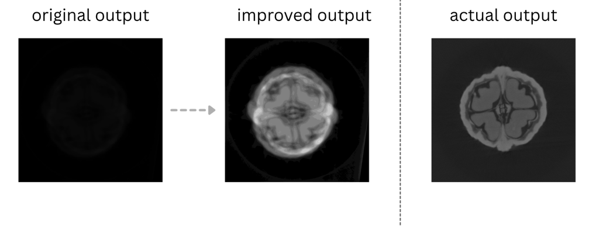

# CT Reconstruction - Pure C++ Implementation

A complete **CPU-based implementation** of **SART**, **SIRT**, and **MART** algorithms for Computed Tomography (CT) reconstruction in **pure C++**.  
This project does not rely on GPU acceleration and may run slowly for large volumes, but provides full control and transparency over the reconstruction process.

---

## Features

### Reconstruction Algorithms
- **SART** (Simultaneous Algebraic Reconstruction Technique) – High-quality, fast convergence  
- **SIRT** (Simultaneous Iterative Reconstruction Technique) – Smoother, less noisy results  
- **MART** (Multiplicative Algebraic Reconstruction Technique) – Multiplicative update method

### Implementation Highlights
- Fan-beam geometry support  
- Negative-log preprocessing  
- Multi-threaded CPU reconstruction using OpenMP  
- Bilinear interpolation  
- Non-negativity constraints  
- Command-line interface with progress updates  
- No GPU dependencies

---

## Requirements

**System Requirements**
- CPU with OpenMP support  
- 16 GB RAM or more recommended for full-volume reconstruction

**Software Dependencies**
- C++17 or newer compiler (GCC / Clang / MSVC)
- CMake ≥ 3.10
- libtiff (for reading `.tif` projections)
- OpenMP (for multithreading)

**Example installation (Ubuntu):**
```bash
sudo apt update
sudo apt install build-essential cmake libtiff-dev
```

---

## Build Instructions

### 1. Setup

```bash
# Create and enter the project directory
mkdir -p ~/ct_reconstruction && cd ~/ct_reconstruction

# Copy source files:
# - ct_reconstruction.cpp
# - CMakeLists.txt
```

### 2. Build

```bash
mkdir build && cd build
cmake .. -DCMAKE_BUILD_TYPE=Release
make -j$(nproc)
```

This creates the executable `ct_recon` in the `build/` directory.

---

## Input Data Preparation

```bash
# Create the input directory
mkdir -p ../raw/projections

# Copy projection .tif images into:
# ~/ct_reconstruction/raw/projections/

# File naming convention:
# proj_0001.tif, proj_0002.tif, ..., proj_0360.tif
```

All projection images must have identical dimensions.

#### source: "https://drive.google.com/drive/folders/1eJ27DzfssGl5s2eUk7Hzn5H27Xl8iikA"

---

## Running Reconstruction

### Basic Usage
```bash
./ct_recon
```

### Custom Options
```bash
# SART with 100 iterations
./ct_recon --algorithm SART --iterations 100 --relaxation 0.7

# SIRT with 150 iterations
./ct_recon --algorithm SIRT --iterations 150 --relaxation 0.5

# MART with 30 iterations
./ct_recon --algorithm MART --iterations 30 --relaxation 0.3

# Reconstruct only selected slices
./ct_recon --z-min 100 --z-max 200

# Show all options
./ct_recon --help
```

---

## Command-Line Options

| Option | Description | Default |
|--------|--------------|----------|
| `--proj-folder PATH` | Input projections folder | `./raw/projections` |
| `--output-folder PATH` | Output folder | `./raw/reconstruction_1` |
| `--algorithm ALG` | Algorithm: `SART`, `SIRT`, or `MART` | `SART` |
| `--iterations N` | Number of iterations | `50` |
| `--relaxation R` | Relaxation factor (0.0–1.0) | `0.5` |
| `--z-min N` | Minimum slice index | `0` |
| `--z-max N` | Maximum slice index | `999` |
| `--threads N` | Number of CPU threads | auto |
| `--no-log` | Skip negative-log preprocessing | off |
| `--help` | Display usage information | — |

---

## Algorithm Notes

| Algorithm | Typical Iterations | Relaxation | Notes |
|------------|--------------------|-------------|--------|
| **SART** | 50–100 | 0.5–0.7 | Best balance of speed and quality |
| **SIRT** | 100–200 | 0.3–0.5 | Produces smoother, low-noise output |
| **MART** | 20–50 | 0.1–0.3 | Specialized multiplicative update scheme |

---

## Geometry Configuration

Adjust in `ct_reconstruction.cpp`:

```cpp
struct GeometryConfig {
    int num_projections = 360;
    int detector_rows = 1000;
    int detector_cols = 1000;
    float sod_mm = 160.0f;     // Source-to-object distance (mm)
    float sdd_mm = 200.0f;     // Source-to-detector distance (mm)
    float pixel_size_mm = 0.048f;
    float cor_pixel = 518.0f;  // Center of rotation (pixels)
    float voxel_size_mm = 0.0384f;
    int recon_xy_dim = 1000;   // Reconstruction resolution
};
```

---


## Output

Reconstructed slices are saved as:
```
raw/reconstruction_1/ALGORITHM_reconstruction/slice_XXXX.tif
```

Example:
```
raw/reconstruction_1/SART_reconstruction/slice_0000.tif
raw/reconstruction_1/SART_reconstruction/slice_0001.tif
...
```

**Note:**  
Output `.tif` slices may appear dark due to low pixel intensities.  
Increase image brightness in your viewer to visualize structures.



---


## Example Workflow

```bash
# Quick test (10 slices, 20 iterations)
./ct_recon --algorithm SART --iterations 20 --z-min 500 --z-max 510

# Full reconstruction
./ct_recon --algorithm SART --iterations 50

# Compare SIRT for smoother results
./ct_recon --algorithm SIRT --iterations 100 --relaxation 0.4
```

---

## Technical Details

### Forward Projection
- Ray-driven approach
- Bilinear interpolation
- Sub-voxel sampling (0.5 voxel steps)

### Back Projection
- Weighted contribution along rays
- Thread-safe accumulation
- Normalized updates

### Convergence
- Controlled by relaxation parameter
- Non-negativity constraint enforced
- Slice-by-slice sequential processing

---


## Contact

**Gaurav Kumar**
Email: *gaurav_k@mfs.iitr.ac.in*  
